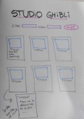

## 1. Definición del producto_ 
Studio Ghibli, conocido en todo el mundo por su magia y creatividad inigualables, ha sido el hogar de algunas de las películas de animación más aclamadas de todos los tiempos. Nuestra página web es un tributo a este mundo mágico y le ofrece a los usuarios una manera única de explorar la filmografía de Studio Ghibli, ya que además de un breve resúmen de cada filme, también podemos ver otros datos importantes como su año de lanzamiento o el número de personajes. Para mejorar la experiencia del usuario se puede ver la información de una película en específico o se puede filtrar el catálogo ya sea por director o productor, así mismo se puede ordenar de acuerdo al año o ranking de cada pelicula de una forma ascendente o descendente. Al hacer este filtro también entrega el promedio de ranking de cada director o productor elegido.

## 2. Historias de Usuarios_

  “Yo como alguien que poco conoce de Studio Ghibli, quiero conocer cuáles son las películas que ha producido Studio Ghibli y de qué tratan”.
  Criterios de aceptación: 
  El usuario puede ver la lista de películas. Crear esqueleto de html, en Javascript función renderItems para desplegar la data, creación de tarjetas para visualizar esa data de mejor forma.
  El usuario puede ver información de cada pelicula. Se edita tarjetas para que la parte delantera se vea poster, titulo, director, productor, año y ranking de cada pelicula. En la parte trasera de la tarjeta se logra ver la descripción
  Definición de terminado:
  En la página se visualiza el catálogo completo de películas a modo de tarjetas.
  La visualización es responsive.

  “Busco una lista de las películas dirigidas por “xx” director en Studio Ghibli”.
  Criterios de aceptación: 
  El usuario puede filtrar las peliculas de acuerdo al director que elija. Se hace select con opciones de director a elegir, se crea función "filterData".
  //se incluye productor al filtro
  Definición de terminado:
  En la página, al elegir un director o productor de la lista se pueden visualizar únicamente las tarjetas que corresponden a dicho valor.
  Al dar click en el botón de reset se pueden volver a ver las tarjetas del catálogo completo.

  "Quiero ver una lista de las películas publicadas por Studio Ghibli y poder ordenarlas por el año en el que fueron publicadas".
  Criterios de aceptación:
  El usuario puede decidir ordenar esas peliculas por año, de forma ascendente y descendente. Se hace select con orden de año, otro select con orden descendente o ascendente. Se crea función "sortData".
  //se incluye ranking en orden
  Definición terminado:
  Las tarjetas de los filmes se ordenan de manera indicada.
  El ordenamiento respeta las condiciones de filtrado.
  Al dar click en el botón de reset se pueden volver a ver las tarjetas del catálogo completo en el orden original.

  "Teniendo una lista de las películas realizadas por Studio Ghibli, me gustaría conocer cuántos personajes tiene cada película".
  El usuario al hacer filtro por director/productor, al momento que se visualizan las peliculas, estas entregan la información de cuantos personajes tiene cada pelicula.
  Se crea función "peopleData".

  "Me gustaría saber el promedio de ranking de cada director o productor".
  El usuario al hacer el filtro correspondiente, puede ver en la pagina el promedio de ranking de cada director/productor que elija.
  Se crea función "computeStat".

  
  ## 3. Prototipo_

   Un _sketch_ de la solución (prototipo de baja fidelidad) y
  _Diseño de la Interfaz de Usuario_ (prototipo de alta fidelidad):
  
  Nos guiamos de este wireframe para pensar en nuestro prototipo:
  
  
  Y aquí como se hizo en papel: 
  Como fue pensado en una página web en computadora
  
  
  
  Y pensado responsive en pantalla de celular:
  
  
  
  
  Y acá esta nuestro prototipo de alta fidelidad :
  
  
  
  Y acá el link donde se trabajó en figma: https://www.figma.com/file/OGIDbJZ4YSv4sEJbYvVndd/Untitled?type=design&node-id=0%3A1&mode=design&t=jqjyvKv3b02mKPeL-1 

  ## 4. El listado de problemas que detectaste a través de tests de usabilidad_
  
  Al principio le habíamos puesto como fondo una imagen, notamos que sería mucha carga visual para el usuario ya que cada tarjeta tendría la imagen de cada pelicula, concluímos que sería mejor dejar un fondo de un tono claro y en el header una imagen que representará el arte de Studio Ghibli.

  Tanto título, como algunas caracteristicas de las tarjetas estaba con un color que no hacía suficiente contraste con el fondo, se hacía incomodo de leer, se cambió el color y se puso un sombreado para darle mayor protagonismo.

  No estaba claro que las tarjetas al pasar el cursor se daban vuelta para mostrar más información, entonces se puso un mensaje antes de los select para informar de esto al usuario.
  
  
